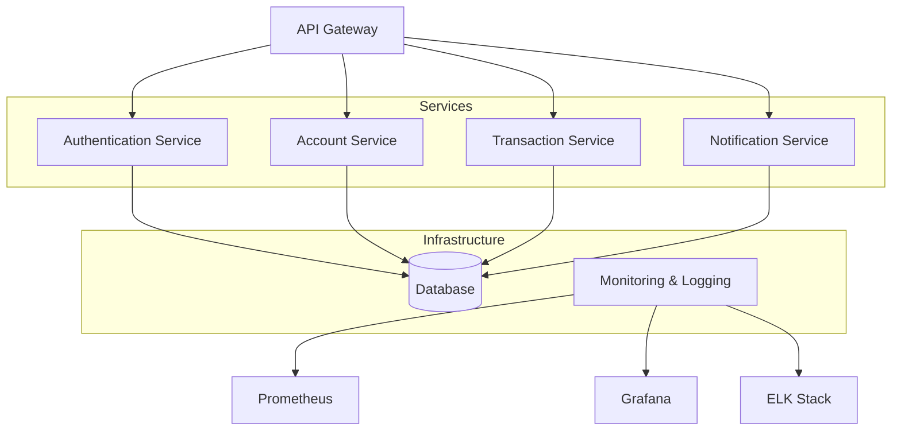

```mermaid
graph TD;
    A[API Gateway] --> B[Authentication Service];
    A --> C[Account Service];
    A --> D[Transaction Service];
    A --> E[Notification Service];
    B --> F[(Database)];
    C --> F[(Database)];
    D --> F[(Database)];
    E --> F[(Database)];
    G[Monitoring & Logging] --> H[Prometheus];
    G --> I[Grafana];
    G --> J[ELK Stack];
    subgraph Services
        B;
        C;
        D;
        E;
    end
    subgraph Infrastructure
        F;
        G;
    end
```